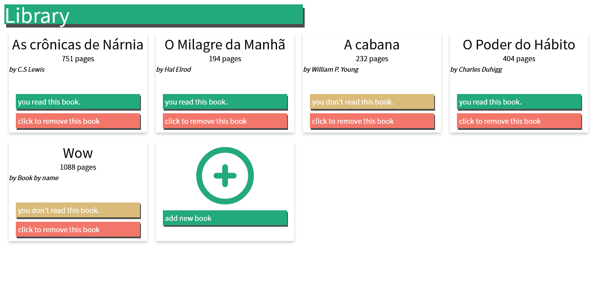
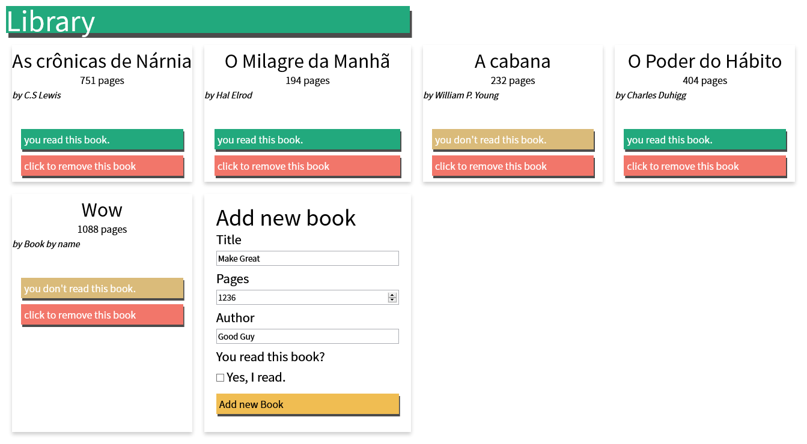
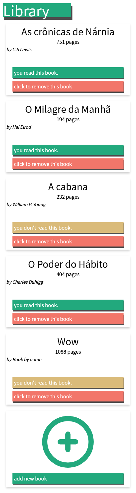

# library-project
An TOP Project that builds a library to add/remove books and mark read.

[Click here to access](https://gabrielsenaco.github.io/library-project/) or click on link: https://gabrielsenaco.github.io/library-project/

## Screenshots

### Desktop version:

### Desktop form version:

### Mobile verison:
